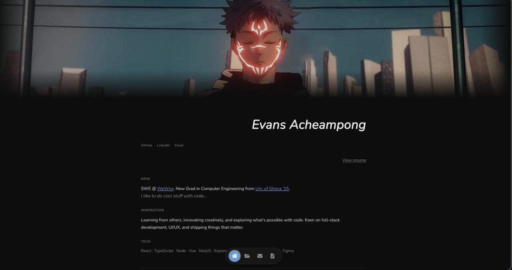

# Moi



Personal portfolio. Built with HTML, CSS, and JavaScript.

**Live:** [evansdev.vercel.app](https://evansdev.vercel.app)

## Run locally

```bash
git clone https://github.com/evansachie/moi.git
cd moi
```

Open `index.html` in a browser.

## Structure

- `index.html` — Home (about, work, links)
- `projects.html` — Projects and designs
- `contact.html` — Contact and socials
- `style.css` — Styles
- `script.js` — Footer time, smooth scroll
- `images/` — Banner, favicon
- `assets/` — Resume PDF

## Contact

[GitHub](https://github.com/evansachie) · [LinkedIn](https://www.linkedin.com/in/evans-acheampong/) · [evansachie01@gmail.com](mailto:evansachie01@gmail.com)
